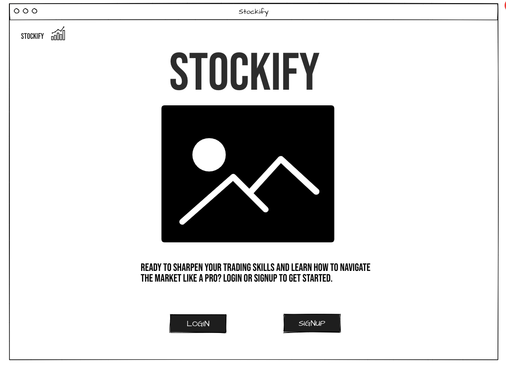
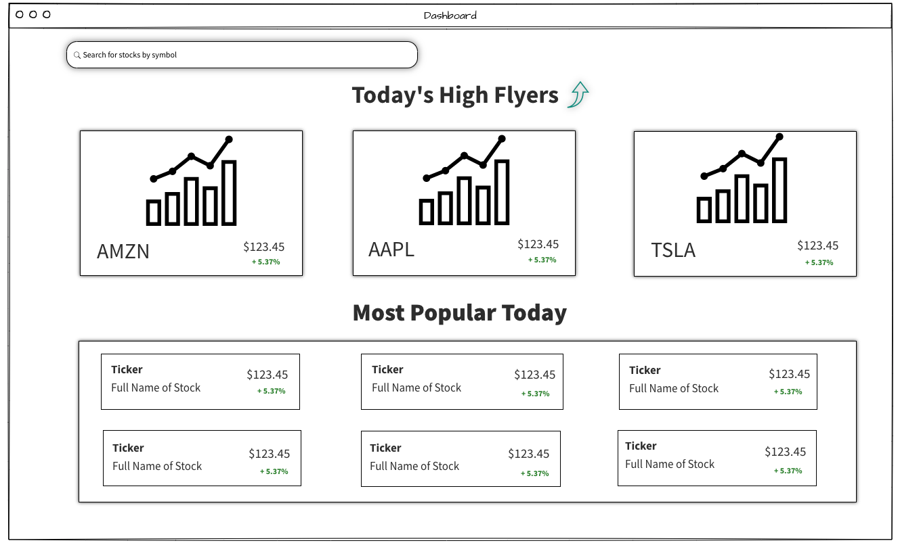
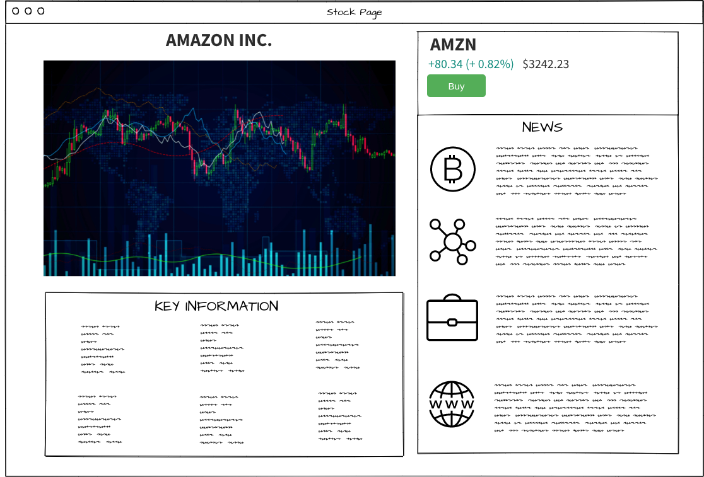
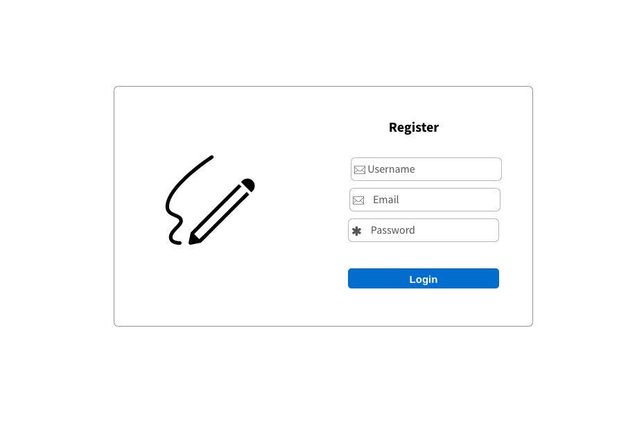
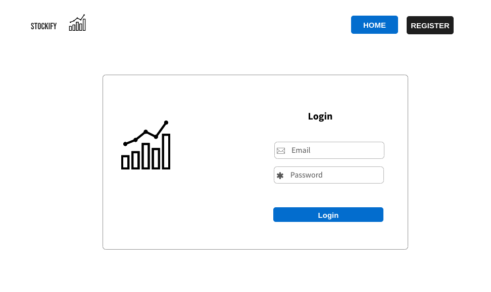

# Stockify

## Introduction

Stockify is a stock market simulation website that allows its users to test their trading skills risk free. By using real time stock prices, Stockify will give users a taste of what trading in the real markets is like.

## User Story

- The Landing page will prompt the user to select the log in or register buttons which will redirect them to the respective page.

- After registering and signing in, the user will be redirected to the Dashboard page, where they will be able to see the most popular stocks of the day. At the top, 3 of the most traded stocks of the day will be displayed along with a daily chart and price for each.
  At the bottom of the page, nine stocks that have relatively high trading volumes compared to others will be displayed. These will show the price and the percent change of price for the day.

- The dashboard will have a search bar that will allow for the user to search for a specific stock by using its ticker symbol. The user can also navigate to one of the stocks being displayed on the stock page by either clicking on the card, or selecting the "View" button on the card

- Each stocks show page will display a large graph of the price movement for the day. There will be three buttons below the graph that will allow the user to change the graph to display yearly, monthly, and daily data

- On the bottom half of the show page, there will be a section that displays other key information about the stock such as Price Earnings ratio, Average volume, 52 week highs/lows, and other relevant information. To the right of the key information, 3 articles that relate to the stock will be displayed with a picture, title and short intro. Users will be able to navigate to each article by clicking on the card that they are displayed on.

- To the right of the graph on a stocks page, there will be a box that shows the full name of the stock, its ticker symbol, its change in price (will display yearly, monthly, or daily depending on what mode the graph is in), the current price of the stock along with a "buy this stock" button. This button will redirect the user to a Buy Stock page.

- On the buy stock page, the user will be asked how many shares of the stock they would like to buy. A total cost of purchase will be displayed and update as the user types in the amount of shares they would like to purchase. Once the user clicks "buy" they will be redirected to their portfolio page where they will be able to view all of the purchases that they have made on their account.

- The portfolio page will display each instance of a purchase that the user that is signed in has made. The number of shares, purchase price, current price, gain/loss and a sell button will be displayed for each instance of a purchase. If a user is happy with their gains, or wants to cut their losses, they can select the sell button to get rid of their shares. The amount that the shares are worth will be added to the users total balance the page will re-render.

## Technologies and APIs used

### Technologies

- HTML
- CSS
- Javascript
- Mongoose
- Express
- Node.js
- React
- Plotly

### APIs

- AlphaVantage - Daily Prices
- IEX Cloud - Weekly, Yearly, Logos
- Aylien - News
- Polygon - Backup prices, Single day prices

## WireFrames

## Home Page

## Dashboard

## Stock Page

## Register

## Login

